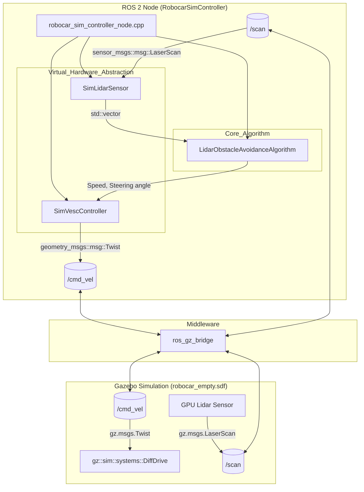
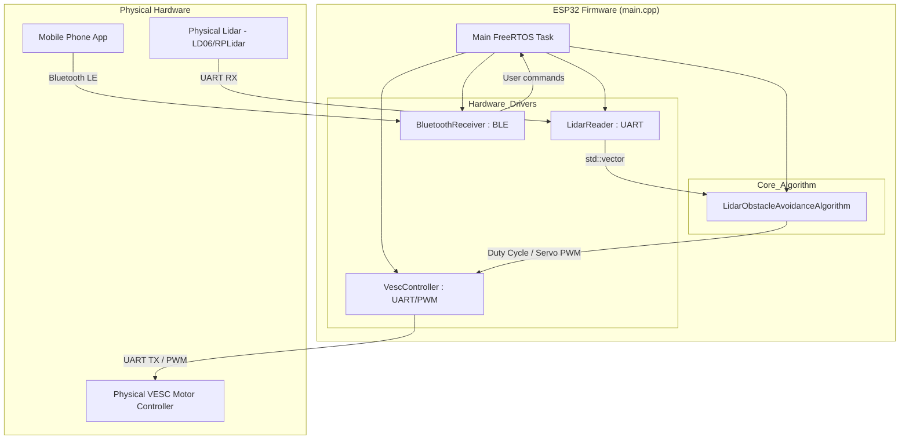
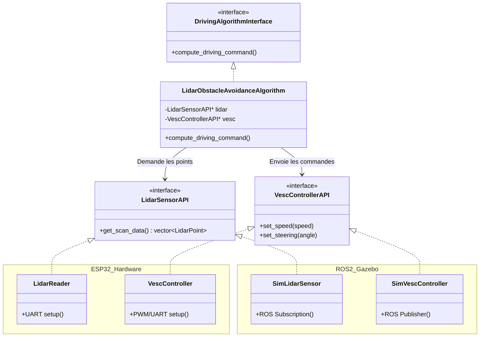

# Robocar Architecture Overview

Ce document présente l'architecture matérielle et logicielle du projet Robocar. L'objectif de la refonte récente était de séparer l'algorithme d'évitement d'obstacles (Core Logic) de l'implémentation matérielle (ESP32) et logicielle (Simulation ROS 2 / Gazebo), en utilisant des interfaces communes.

## 1. Architecture de la Simulation (ROS 2 + Gazebo)

Dans cet environnement, le code tourne nativement sur l'ordinateur de développement (Linux). Les périphériques physiques sont remplacés par des nœuds ROS et des plugins Gazebo.

---

## 2. Architecture Réelle (Embarquée sur ESP32)

Sur l'appareil réel, le firmware s'exécute sur l'ESP32 via FreeRTOS. Le code interagit directement avec les périphériques I2C, SPI, UART, PWM, et BLE.

---

## 3. Architecture Unifiée (Dépendances et Interfaces)

Au cœur du système se trouve le principe d'Inversion de Dépendance (DIP - SOLID). Le `LidarObstacleAvoidanceAlgorithm` ne connaît pas l'ESP32 ni ROS2. Il s'adresse uniquement à des interfaces neutres abstraites (API).

### Bénéfices de ce modèle commun
- **Portabilité :** Le même algorithme (`LidarObstacleAvoidanceAlgorithm`) est cloné et testé en simulation sans modification de son code source.
- **Mocking pour les tests :** Possibilité de créer des faux Lidars (des Mocks) qui injectent des obstacles virtuels pour valider unitairement l'algorithme.
- **Séparation des préoccupations :** Les bugs de ROS 2 ou de pont Gazebo n'impacteront jamais le code qui tourne physiquement sur l'ESP32.
